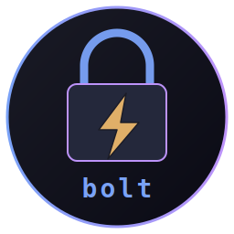
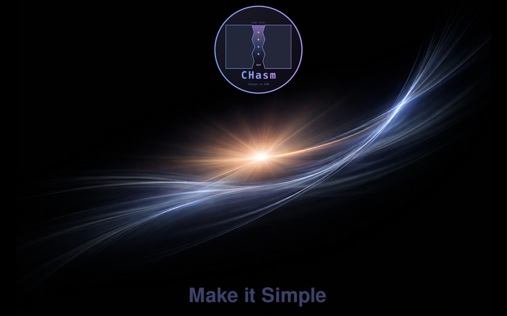

# bolt — pure-asm screen locker



      

A small, fast screen locker for the **CHasm** (CHange to ASM) desktop
suite. Two binaries:

- **bolt** — pure x86_64 NASM, no libc, no toolkit. Owns the X session
  while it runs: creates a fullscreen override-redirect window, grabs
  keyboard + pointer, accepts keystrokes into a hidden buffer, draws
  one square per typed character.
- **bolt-auth** — ~80 lines of C, suid root. Reads the password line
  on stdin, calls `crypt()` against the user's shadow entry, exits 0/1.
  bolt forks + pipes to it on Enter; nothing else has root.

Part of the [CHasm](https://github.com/isene/chasm) suite alongside
[bare](https://github.com/isene/bare),
[show](https://github.com/isene/show),
[glass](https://github.com/isene/glass),
[tile](https://github.com/isene/tile),
[chasm-bits](https://github.com/isene/chasm-bits) and
[glyph](https://github.com/isene/glyph).

<br clear="left"/>



The split keeps the audit-able privileged code small and language-boring,
while the locker UI stays in the asm style of the rest of the suite.

## Build

```bash
make            # both binaries
sudo make install
```

`make install` puts `/usr/local/bin/bolt` (mode 0755) and
`/usr/local/bin/bolt-auth` (mode 4755, owner root, group root). The
suid bit is what lets `bolt-auth` read `/etc/shadow`.

## Use

```bash
/usr/local/bin/bolt
```

bolt reads `~/.lockrc` for config (see `.lockrc.example`), connects to
`$DISPLAY`, draws the lock screen, grabs input. Type your login password
and hit Enter:

- correct → bolt ungrabs and exits 0.
- wrong → squares clear, lock screen stays up.
- `Esc` clears the typed buffer; `Backspace` removes one byte.

**Fingerprint:** if `/usr/bin/fprintd-verify` is installed and you have
an enrolled finger (`fprintd-list $USER`), bolt forks it as a sibling
auth process at lock-start. A matching touch unlocks the screen
without typing — bolt's `poll(2)` loop watches the fprintd child's
stdout pipe, reaps the child on EOF, and unlocks if it exited 0. The
password path runs in parallel; whichever signals success first wins.
On unlock bolt sends `SIGTERM` to the fingerprint child so the reader
goes cold immediately. Systems without fprintd installed silently fall
through to the password-only path.

Trigger from your window manager. For tile (`~/.tilerc`):

```
bind Mod4+Ctrl+l        exec /usr/local/bin/bolt
bind Mod4+Escape        exec /usr/local/bin/bolt
```

Or wrap suspend so the laptop is locked before sleeping:

```bash
#!/usr/bin/env bash
/usr/local/bin/bolt &
disown
sudo systemctl suspend
```

For an idle-driven lock, pair with `xss-lock`:

```bash
xss-lock --notifier=- /usr/local/bin/bolt &
```

## Lock screen image

bolt is intentionally dumb about graphics: it expects a single
**flat raw-RGB blob** matching your screen geometry, mmaps it, and
blits it as the background. No PNG/JPG decoder in asm, no per-frame
overlay, no font rendering. You compose the entire lock screen
(wallpaper + logo + tagline + whatever else) in your favourite
image editor, then bake it once.

A helper script ships with the repo (`boltimage.sh`) that resizes any
PNG to 1920×1200 (configurable), pads with the bg_color, and writes
`~/.lockbg.rgb`:

```bash
./boltimage.sh ~/lockscreen-source.png    # → ~/.lockbg.rgb
```

Then point `~/.lockrc` at it:

```
bg_color   = 0x000000
bg_image   = /home/you/.lockbg.rgb
accent     = 0xffffff      # password-square colour
text_color = 0xffffff
```

If the file is missing or the wrong size bolt falls back to `bg_color`.

## Configuration

`~/.lockrc` is line-based `key = value`. See `.lockrc.example` for the
full list:

```
bg_color   = 0x000000                          # ARGB hex; 0xff alpha forced
bg_image   = /home/you/.lockbg.rgb             # raw RGB blob (W*H*3 bytes)
accent     = 0xffffff                          # password-square colour
text_color = 0xffffff                          # tagline / fallback text
tagline    = Make it Simple                    # only used when no bg_image
font       = -*-fixed-bold-r-normal-*-20-*-*-*-*-*-*-*
```

The `tagline` and `font` keys are only used when bolt falls back to
its built-in render path (no bg_image, or an image that failed to
load). With a bg_image, bolt skips text rendering entirely — the
tagline lives in your baked PNG.

## Security model

- `bolt` itself never has elevated privileges. It runs entirely as your
  user.
- `bolt-auth` is suid root; that is the **only** way it can read
  `/etc/shadow`. Its job is one fixed task: read a password from stdin,
  return 0/1. It calls `mlock()` on the password buffer, zeroes it
  before returning, and closes inherited fds 3+ before reading.
- The password is wiped from bolt's memory the moment the helper
  returns, success or fail.
- bolt calls `XGrabKeyboard` + `XGrabPointer` in a retry loop; if
  another client already holds the grabs (another locker, an
  unresponsive app), it bails out with exit 2 rather than half-locking
  the session.

## Known v0.1 limits

- **Single output**: bolt covers root-window extents. On multi-monitor
  it works but the bg_image is anchored at (0,0); your composition
  needs to know the combined-root resolution.
- **Background image** is bake-once raw RGB. PNG / JPG decoding inside
  asm is a separate project (we already have a TTF rasterizer in
  [glyph](https://github.com/isene/glyph); an image decoder would be
  similar). Bake at install time.
- **Fallback tagline** uses an X11 core font (XLoadFont + PolyText8).
  Looks pixel-fixed; fine for a fallback. With `bg_image` set, the
  tagline lives in the baked PNG so font choice is unconstrained.
- **No auto-lock daemon**: trigger via tile keybinding, suspend
  wrapper, or `xss-lock`.

## License

[Unlicense](https://unlicense.org/) — public domain.

## Credits

Created by Geir Isene, with extensive pair-programming with Claude Code.
Part of the [CHasm](https://github.com/isene/chasm) desktop suite.
